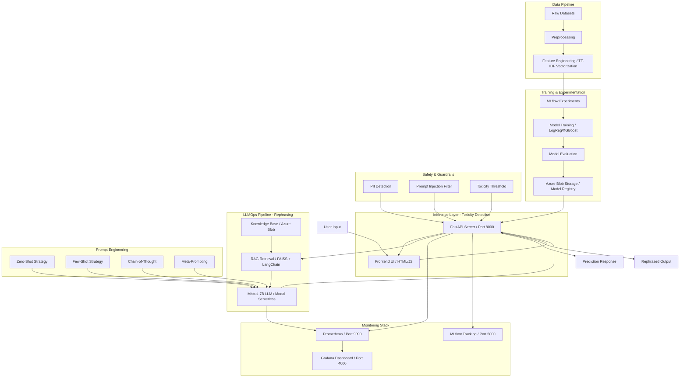
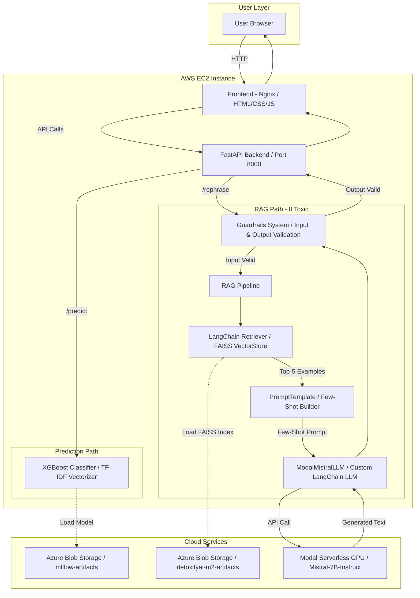
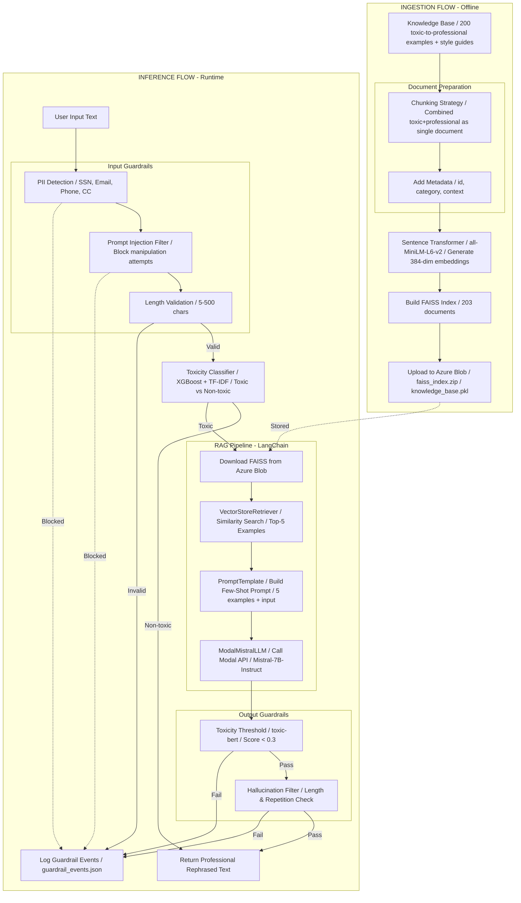

# DetoxifyAI 🛡️

> Real-time ML-powered toxicity detection with LLM-based professional rephrasing for social platforms and content moderation

DetoxifyAI is a complete MLOps and LLMOps pipeline that detects toxic content using machine learning models (Logistic Regression and XGBoost) and automatically rephrases toxic messages into professional alternatives using Large Language Models with Retrieval-Augmented Generation (RAG). The system provides confidence scores, guardrails, and comprehensive monitoring for automated content moderation at scale.

## Architecture



## Quick Start

```bash
# Clone the repository
git clone https://github.com/al-Jurjani/DetoxifyAI.git
cd DetoxifyAI

# Set up environment variables
cp .env.example .env
# Edit .env with your Azure Storage credentials, Modal API key, etc.

# Install dependencies
pip install -r requirements.txt

# Run development server
uvicorn app.main:app --reload --host 0.0.0.0 --port 8000
```

Access the application:
- API: http://localhost:8000
- Frontend: Open `frontend/index.html` in a browser
- API Docs: http://localhost:8000/docs

Online VM's (Might be offline)
- MLFlow: http://13.50.244.152:5000/


- Frontend: http://16.16.193.183/


## Prerequisites

- Python 3.11+
- Docker and Docker Compose (for monitoring stack)
- Azure Storage Account (for model artifacts and RAG knowledge base)
- MLflow (for experiment tracking)
- Modal account (for LLM hosting)
- Weights & Biases account (optional, for prompt experiment tracking)

## Project Overview & LLMOps Objectives

DetoxifyAI demonstrates a complete MLOps and LLMOps workflow combining:

### MLOps Components (Milestone 1)
- **Binary Classification**: Trained models for toxic vs non-toxic text detection
- **Model Registry**: Azure Blob Storage with versioned artifacts
- **CI/CD Pipeline**: Automated testing, Docker builds, and canary deployments
- **Monitoring**: Prometheus metrics, Grafana dashboards, Evidently drift detection

### LLMOps Components (Milestone 2)
- **Prompt Engineering**: Multiple strategies (Zero-Shot, Few-Shot, Chain-of-Thought, Meta-Prompting) with systematic evaluation
- **RAG Pipeline**: Knowledge base ingestion, FAISS vector retrieval, and LLM-powered rephrasing using Mistral-7B
- **Guardrails**: PII detection, prompt injection filtering, toxicity thresholds for input/output safety
- **LLM Monitoring**: Token usage tracking, latency measurement, cost monitoring, guardrail violation logging
- **Multi-Cloud Deployment**: AWS EC2 (FastAPI), Azure Blob (storage), Modal (LLM inference)

## Make Targets

### Development
```bash
# Install dependencies
pip install -r requirements.txt

# Install development dependencies
pip install -r requirements-dev.txt

# Run FastAPI server with hot-reload
uvicorn app.main:app --reload --host 0.0.0.0 --port 8000

# Run RAG pipeline end-to-end (M2)
make rag  # Ingests knowledge base and starts inference API
```

### Testing
```bash
# Run all tests with coverage (80% minimum for M2)
pytest --cov=app --cov=src --cov-report=xml --cov-fail-under=80

# Run tests with verbose output
pytest -v

# Run linting (ruff + black)
ruff check .
black --check .

# Auto-format code
black .
```

### Docker Operations
```bash
# Build production Docker image
docker build -t detoxifyai:latest .

# Run Docker container locally
docker run -p 8000:8000 --env-file .env detoxifyai:latest

# Start monitoring stack (Prometheus + Grafana)
docker-compose up --build

# Stop all containers
docker-compose down
```

### ML Operations
```bash
# Train model with MLflow tracking
cd MLFlow/experiments
export MLFLOW_TRACKING_URI="http://127.0.0.1:5000"

# For Windows PowerShell:
$env:MLFLOW_TRACKING_URI = "http://127.0.0.1:5000"

# Run XGBoost experiments
mlflow run . --env-manager=local --experiment-name xg_models

# Run Logistic Regression experiments
mlflow run . --env-manager=local --experiment-name lr_models

# Start MLflow UI
mlflow ui --host 0.0.0.0 --port 5000

# View experiment results at http://localhost:5000
```

### Deployment
```bash
# Check API health status
curl http://localhost:8000/health

# Test toxicity prediction endpoint
curl -X POST http://localhost:8000/predict \
  -H "Content-Type: application/json" \
  -d '{"text": "Your text here"}'

# Test rephrasing endpoint (M2)
curl -X POST http://localhost:8000/rephrase \
  -H "Content-Type: application/json" \
  -d '{"text": "You stupid idiot!"}'

# View Prometheus metrics
curl http://localhost:8000/metrics
```

## Project Structure

```
.
├── app/                          # FastAPI application (M1)
│   └── main.py                  # Main API with endpoints, model loading, metrics
├── src/                          # LLMOps components (M2)
│   ├── rag_pipeline.py          # RAG retrieval and inference
│   ├── ingest.py                # Knowledge base ingestion to Azure Blob
│   ├── guardrails.py            # Safety mechanisms (PII, prompt injection, toxicity)
│   └── prompts/                 # Prompt engineering strategies
│       ├── zero_shot.py        # Baseline prompting
│       ├── few_shot.py         # Example-driven prompting
│       ├── chain_of_thought.py # Step-by-step reasoning
│       └── meta_prompting.py   # Structured persona-based prompting
├── experiments/                  # Prompt experiments (M2)
│   ├── prompts/                # Prompt strategy implementations
│   ├── evaluation/             # Evaluation scripts and results
│   └── prompt_report.md        # Detailed prompt comparison analysis
├── data/                         # Datasets (M2)
│   ├── eval.jsonl              # Held-out evaluation dataset
│   └── knowledge_base/         # RAG documents for retrieval
├── frontend/                     # Web interface (M1)
│   ├── index.html              # Frontend UI
│   ├── app.js                  # JavaScript logic
│   └── styles.css              # Styling
├── MLFlow/                       # Machine learning experiments (M1)
│   ├── experiments/
│   │   ├── train.py            # Training script with hyperparameter tuning
│   │   ├── MLproject           # MLflow project configuration
│   │   ├── params.yaml         # Default hyperparameters
│   │   └── combined_dataset.csv # Training data
│   └── src/
│       └── testing_mlflow.py   # MLflow integration tests
├── tests/                        # Test suite (M1 + M2)
│   ├── test_main.py            # API endpoint tests
│   ├── test_rag.py             # RAG pipeline tests
│   ├── test_guardrails.py      # Safety mechanism tests
│   ├── test_prompts.py         # Prompt strategy tests
│   └── golden.json             # Acceptance test queries
├── deploy/                       # Deployment documentation (M1)
│   ├── AWS_DEPLOYMENT.md       # AWS EC2 deployment guide
│   └── MODAL_DEPLOYMENT.md     # Modal LLM deployment guide (M2)
├── prometheus/                   # Monitoring configuration (M1)
│   └── prometheus.yml          # Prometheus scrape config
├── grafana/                      # Grafana dashboards (M1 + M2)
│   ├── ml_monitoring.json      # ML model metrics dashboard
│   └── llm_monitoring.json     # LLM metrics dashboard (M2)
├── Notebooks/                    # Jupyter notebooks for experimentation
├── Data/                         # Raw datasets (gitignored)
├── Evidently/                    # Data drift monitoring (M1)
├── evidently_workspace/          # Evidently dashboard workspace (M1)
├── .github/
│   └── workflows/
│       └── ci.yml              # CI/CD pipeline (M1 + M2)
├── docker-compose.yml           # Multi-container orchestration
├── Dockerfile                   # Production container image
├── Makefile                     # Build automation (M2)
├── requirements.txt             # Python dependencies
├── requirements-dev.txt         # Development dependencies
├── .env.example                 # Environment variables template
├── .pre-commit-config.yaml     # Pre-commit hooks
├── CONTRIBUTION.md             # Contribution guidelines
├── CODE_OF_CONDUCT.md          # Code of conduct
├── SECURITY.md                 # Security and compliance documentation (M2)
├── EVALUATION.md               # Prompt evaluation methodology and insights (M2)
└── README.md                    # This file
```

## ML Workflow Monitoring

### MLflow Tracking
- **Tracking URI**: http://localhost:5000
- **Model Registry**: Azure Blob Storage (`mlflow-artifacts-mlops-proj` container)
- **Logged Artifacts**:
  - Trained models (model.pkl)
  - TF-IDF vectorizers (tfidf.pkl)
  - Metrics (ROC-AUC, Accuracy, F1-score)
  - Hyperparameters (preprocessor type, ngrams, C, eta, etc.)

#### Starting MLflow
```bash
# Navigate to experiments directory
cd MLFlow/experiments

# Set tracking URI
export MLFLOW_TRACKING_URI="http://127.0.0.1:5000"  # Linux/Mac
$env:MLFLOW_TRACKING_URI = "http://127.0.0.1:5000"  # Windows

# Start MLflow UI server
mlflow ui --host 0.0.0.0 --port 5000

# In another terminal, run experiments
mlflow run . --env-manager=local --experiment-name xg_models
```

### Weights & Biases (Prompt Experiment Tracking)


- **Purpose**: Track and compare prompt engineering experiments (M2)
- **Project**: `detoxifyai-prompt-evaluation`
- **Tracked Metrics**:
  - Cosine similarity per prompt strategy
  - Latency distributions
  - Manual evaluation scores (Tone, Intent, Length)
  - Per-example outputs and comparisons
- **Integration**: Automated logging during prompt evaluation experiments

#### Accessing W&B Dashboard
```bash
# Set API key
export WANDB_API_KEY=your_key_here

# Experiments are logged automatically during evaluation
python experiments/prompts/evaluate_prompts.py --log-wandb

# View results at: https://wandb.ai/your-username/detoxifyai-prompt-evaluation
```

**Key Features**:
- Side-by-side comparison of Zero-Shot, Few-Shot (k=3, k=5), and Chain-of-Thought strategies
- Hyperparameter tracking (temperature, max_tokens, model version)
- Real-time experiment monitoring during evaluation runs
- Artifact storage for prompt templates and evaluation datasets


### Evidently Dashboard


- **Purpose**: Data drift detection on test sets
- **Location**: `Evidently/` and `evidently_workspace/` directories
- **Usage**: Monitors model performance degradation over time

### Prometheus + Grafana


- **Prometheus**: http://localhost:9090
- **Grafana**: http://localhost:4000 (admin/admin)

#### Monitored Metrics (M1 - ML Models)
- `app_request_count` - Total API requests by endpoint
- `app_request_latency_seconds` - Request latency histogram (p50, p95, p99)
- `model_prediction_duration_seconds` - ML model inference time
- Node exporter metrics (CPU, memory, disk)

#### Monitored Metrics (M2 - LLM Operations)
- `llm_request_count` - LLM API calls by prompt strategy
- `llm_token_usage_total` - Total tokens (prompt + completion) consumed
- `llm_request_duration_seconds` - End-to-end LLM latency
- `llm_cost_usd` - Estimated cost per request
- `guardrail_violations_total` - Safety violations by type (PII, prompt injection, toxicity)
- `rag_retrieval_duration_seconds` - Vector search latency
- `rag_documents_retrieved` - Number of documents fetched per query

#### Starting the Monitoring Stack
```bash
# Start all services
docker-compose up --build

# Services will be available at:
# - FastAPI metrics: http://localhost:8000/metrics
# - Prometheus: http://localhost:9090
# - Grafana: http://localhost:4000

# Stop services
docker-compose down
```

## RAG Pipeline Deployment Guide (M2)

### System Architecture Diagram



### Data Flow Diagram




### Step-by-Step Deployment

#### 1. Prepare Knowledge Base
```bash
# Place documents in data/knowledge_base/
mkdir -p data/knowledge_base
cp your_documents.txt data/knowledge_base/

# Supported formats: .txt, .pdf, .md
```

#### 2. Ingest Documents to Azure Blob
```bash
# Set Azure credentials in .env
# AZURE_STORAGE_CONNECTION_STRING=...

# Run ingestion pipeline
python src/ingest.py --knowledge-base data/knowledge_base/ --upload-to-azure

# This will:
# - Process documents
# - Create FAISS vector index
# - Upload embeddings and index to Azure Blob Storage
```

#### 3. Deploy Mistral-7B LLM on Modal
```bash
# Install Modal CLI
pip install modal

# Authenticate
modal token set --token-id <TOKEN_ID> --token-secret <TOKEN_SECRET>

# Deploy LLM service
modal deploy src/modal_llm.py

# Note the deployed endpoint URL and add to .env:
# MODAL_LLM_ENDPOINT=https://your-app.modal.run
```

#### 4. Start FastAPI Application
```bash
# Run with RAG enabled
uvicorn app.main:app --host 0.0.0.0 --port 8000

# The API will:
# - Load FAISS index from Azure Blob on startup
# - Connect to Modal LLM endpoint
# - Enable /rephrase endpoint
```

#### 5. Verify RAG Pipeline
```bash
# Test rephrasing endpoint
curl -X POST http://localhost:8000/rephrase \
  -H "Content-Type: application/json" \
  -d '{"text": "You are such an idiot!"}'

# Expected response:
# {
#   "original": "You are such an idiot!",
#   "rephrased": "I respectfully disagree with your perspective.",
#   "toxicity_score": 0.92,
#   "rag_context": ["Professional communication guidelines...", ...],
#   "prompt_strategy": "few_shot",
#   "guardrails_passed": true
# }
```

## API Documentation

### Interactive Documentation
- **Swagger UI**: http://localhost:8000/docs
- **ReDoc**: http://localhost:8000/redoc


### Endpoints

#### Health Check
```bash
GET /health

Response:
{
  "status": "ok",
  "model_loaded": true,
  "llm_available": true,
  "rag_index_loaded": true
}
```

#### Predict Toxicity (M1)
```bash
POST /predict

Request Body:
{
  "text": "Your comment or text to analyze"
}

Response:
{
  "input": "Your comment or text to analyze",
  "prediction": "toxic" | "non-toxic",
  "confidence": 0.87,
  "toxic_probability": 0.13,
  "model_loaded": true
}
```

#### Rephrase Toxic Text (M2)
```bash
POST /rephrase

Request Body:
{
  "text": "You stupid moron, you don't know anything!",
  "prompt_strategy": "few_shot"  # Optional: "zero_shot", "few_shot", "cot", "meta"
}

Response:
{
  "original": "You stupid moron, you don't know anything!",
  "rephrased": "I believe there may be a misunderstanding. Could we discuss this respectfully?",
  "toxicity_score": 0.94,
  "rephrased_toxicity_score": 0.02,
  "rag_context": [
    "Professional communication emphasizes respect and constructive dialogue...",
    "When disagreeing, focus on the issue rather than personal attacks..."
  ],
  "prompt_strategy_used": "few_shot",
  "tokens_used": 156,
  "latency_ms": 1243,
  "guardrails_passed": true,
  "guardrail_checks": {
    "pii_detected": false,
    "prompt_injection": false,
    "output_toxicity_safe": true
  }
}
```

#### Prometheus Metrics
```bash
GET /metrics

Returns Prometheus-formatted metrics for scraping
```

### Example Usage

```python
import requests

# Health check
response = requests.get("http://localhost:8000/health")
print(response.json())

# Predict toxicity (M1)
payload = {"text": "You are amazing and helpful!"}
response = requests.post("http://localhost:8000/predict", json=payload)
result = response.json()

print(f"Prediction: {result['prediction']}")
print(f"Confidence: {result['confidence']:.2%}")

# Rephrase toxic text (M2)
payload = {
    "text": "You're so stupid, I can't believe you said that!",
    "prompt_strategy": "chain_of_thought"
}
response = requests.post("http://localhost:8000/rephrase", json=payload)
result = response.json()

print(f"Original: {result['original']}")
print(f"Rephrased: {result['rephrased']}")
print(f"Toxicity reduced: {result['toxicity_score']:.2f} → {result['rephrased_toxicity_score']:.2f}")
print(f"Strategy: {result['prompt_strategy_used']}")
print(f"Tokens: {result['tokens_used']}")
```

## Cloud Deployment (Multi-Cloud Architecture)

### Cloud Services Used (D7 - M2)


#### 1. AWS EC2 (Compute - FastAPI Backend)
- **Instance Type**: t2.small (upgraded for M2 with additional swap)
- **Purpose**: Hosts FastAPI application, serves prediction and rephrasing endpoints
- **Configuration**: Ubuntu 22.04, Docker, Nginx reverse proxy
- **Why**: Dedicated compute for API serving with persistent availability

#### 2. Azure Blob Storage (Storage - Artifacts & RAG Data)
- **Container 1**: `mlflow-artifacts-mlops-proj` (M1 ML models)
- **Container 2**: `detoxifyai-rag-artifacts` (M2 knowledge base, FAISS index, embeddings)
- **Purpose**: Centralized artifact storage with versioning
- **Why**: Cost-effective object storage with high availability and MLflow integration

#### 3. Modal (Serverless GPU - LLM Inference)
- **Model**: Mistral-7B-Instruct-v0.1 (4-bit quantization)
- **Resources**: Auto-scaling GPU instances (A10G)
- **Purpose**: On-demand LLM inference with cold-start optimization
- **Why**: Serverless GPU compute eliminates infrastructure management, pay-per-request pricing

### Service Interaction Flow
```
User Request → AWS EC2 (FastAPI)
             ↓
             ├→ Azure Blob (Load FAISS Index + Knowledge Base)
             ├→ Local FAISS (Retrieve Context)
             ├→ Modal (Mistral-7B Inference)
             ↓
         Response with Rephrased Text
```

### Setup Instructions

#### 1. Azure Storage Setup (M1 + M2)
```bash
# Create storage account (via Azure Portal or CLI)
az storage account create \
  --name detoxifyaistorage \
  --resource-group mlops-resources \
  --location eastus \
  --sku Standard_LRS

# Get connection string
az storage account show-connection-string \
  --name detoxifyaistorage \
  --resource-group mlops-resources

# Create containers
az storage container create \
  --name mlflow-artifacts-mlops-proj \
  --connection-string "<connection-string>"

az storage container create \
  --name detoxifyai-rag-artifacts \
  --connection-string "<connection-string>"
```

#### 2. Modal LLM Deployment (M2)
```bash
# Install Modal
pip install modal

# Set token
modal token set --token-id <ID> --token-secret <SECRET>

# Deploy Mistral-7B
modal deploy src/modal_llm.py

# Test endpoint
curl -X POST https://your-app.modal.run/generate \
  -H "Content-Type: application/json" \
  -d '{"prompt": "Rephrase: You are stupid", "max_tokens": 100}'
```

#### 3. AWS EC2 Deployment (M1 + M2)
See [deploy/AWS_DEPLOYMENT.md](deploy/AWS_DEPLOYMENT.md) for detailed EC2 setup.

Key steps:
```bash
# SSH into EC2
ssh -i keypair.pem ubuntu@<EC2_PUBLIC_IP>

# Clone repo
git clone https://github.com/al-Jurjani/DetoxifyAI.git
cd DetoxifyAI

# Set environment variables
nano .env
# Add AZURE_STORAGE_CONNECTION_STRING, MODAL_LLM_ENDPOINT

# Run with Docker
docker-compose up -d

# Verify
curl http://<EC2_PUBLIC_IP>:8000/health
```

#### 4. Configure Environment Variables
```bash
# Copy example file
cp .env.example .env

# Edit .env and add:
AZURE_STORAGE_CONNECTION_STRING="DefaultEndpointsProtocol=https;AccountName=...;AccountKey=...;EndpointSuffix=core.windows.net"
MLFLOW_TRACKING_URI=http://localhost:5000
MODAL_LLM_ENDPOINT=https://your-app.modal.run
MODAL_API_TOKEN=<your_modal_token>
WANDB_API_KEY=<your_wandb_key>  # Optional for prompt tracking
```

## Azure Blob View


## CI/CD Pipeline (D5 - M1 + M2)


### Workflow Overview
The project uses GitHub Actions for continuous integration and deployment:

```yaml
Workflow: .github/workflows/ci.yml
Triggers: Push to main, Pull requests to main

Jobs:
1. Lint (ruff + black code quality checks)
2. Test (pytest with 80% coverage requirement for M2)
   - Unit tests for ML models (M1)
   - Unit tests for RAG pipeline (M2)
   - Unit tests for guardrails (M2)
   - Integration tests for API endpoints
3. Prompt Evaluation (M2)
   - Automated prompt testing on eval dataset
   - ROUGE-L metric calculation
   - Results logged to Weights & Biases
4. Build & Push (Docker image to ghcr.io)
5. Canary Deploy + Acceptance Tests
   - Deploy to canary environment
   - Run golden query tests
   - Validate ML predictions and LLM rephrasing
6. Security Scan (M2)
   - pip-audit for dependency vulnerabilities
   - Critical CVEs fail the build

Environment Variables:
- AZURE_STORAGE_CONNECTION_STRING (secret)
- MODAL_API_TOKEN (secret, M2)
- WANDB_API_KEY (secret, M2)
- IMAGE_NAME: ghcr.io/al-jurjani/detoxifyai
```

### Coverage Requirements
- **M1**: 65% minimum coverage for ML model and API code
- **M2**: 80% minimum coverage including RAG pipeline, guardrails, and prompt strategies

<!--  -->

## Security & Compliance (D8 - M2)

See [SECURITY.md](SECURITY.md) for comprehensive security documentation.

### Key Security Measures

#### Prompt Injection Defense
- Input validation using regex patterns and NeMo Guardrails
- Sanitization of user inputs before LLM processing
- Allowlist of safe prompt patterns
- Logging of suspicious inputs for review

#### Data Privacy
- PII detection using Microsoft Presidio
- Automatic redaction of emails, phone numbers, SSNs, credit cards
- No storage of user inputs containing PII
- Azure Blob Storage with encryption at rest

#### Responsible AI Guidelines
- Output toxicity filtering (threshold: 0.3)
- Hallucination detection through RAG grounding
- Bias monitoring in LLM outputs
- Human-in-the-loop review for edge cases

#### Dependency Scanning
- `pip-audit` runs in CI pipeline
- Critical CVEs fail the build
- Weekly automated dependency updates via Dependabot

## FAQ

### Common Build Errors

**Q: Docker build fails with "unable to find image"**
```bash
# Solution: Pull base image explicitly
docker pull python:3.11-slim
```

**Q: Permission denied when running Docker commands**
```bash
# Solution (Linux): Add user to docker group
sudo usermod -aG docker $USER
newgrp docker  # Refresh group membership

# Solution (Windows): Run Docker Desktop as Administrator
```

**Q: Port already in use errors**
```bash
# Solution: Stop conflicting services
docker-compose down

# Or find and kill process using the port
# Linux/Mac:
lsof -ti:8000 | xargs kill -9

# Windows:
netstat -ano | findstr :8000
taskkill /PID <PID> /F

# Or change ports in docker-compose.yml
```

**Q: Module not found errors**
```bash
# Solution: Reinstall dependencies
pip install --upgrade pip
pip install -r requirements.txt

# If using virtual environment, ensure it's activated
source venv/bin/activate  # Linux/Mac
venv\Scripts\activate     # Windows
```

**Q: RAG pipeline fails to load FAISS index (M2)**
```bash
# Solution: Verify Azure Blob connection
python -c "
from azure.storage.blob import BlobServiceClient
import os
client = BlobServiceClient.from_connection_string(os.getenv('AZURE_STORAGE_CONNECTION_STRING'))
print(list(client.get_container_client('detoxifyai-rag-artifacts').list_blobs()))
"

# Re-ingest knowledge base if needed
python src/ingest.py --knowledge-base data/knowledge_base/ --upload-to-azure
```

**Q: Modal LLM service unavailable (M2)**
```bash
# Solution: Check Modal deployment status
modal app logs <app-name>

# Verify endpoint in .env
echo $MODAL_LLM_ENDPOINT

# Test endpoint directly
curl -X POST $MODAL_LLM_ENDPOINT/generate \
  -H "Content-Type: application/json" \
  -d '{"prompt": "test", "max_tokens": 10}'
```

### Platform-Specific Setup

#### Windows
```bash
# Option 1: Use WSL2 (Recommended)
wsl --install
wsl --set-default-version 2

# Install Docker Desktop for Windows
# Enable WSL2 integration in Docker Desktop settings

# Clone repo in WSL2 environment
cd /home/<username>
git clone https://github.com/al-Jurjani/DetoxifyAI.git

# Run commands in WSL2 terminal
cd DetoxifyAI
pip install -r requirements.txt
uvicorn app.main:app --reload

# Option 2: Native Windows (PowerShell)
# Set environment variables
$env:MLFLOW_TRACKING_URI = "http://127.0.0.1:5000"
$env:AZURE_STORAGE_CONNECTION_STRING = "your-connection-string"
$env:MODAL_LLM_ENDPOINT = "https://your-app.modal.run"

# Run uvicorn
python -m uvicorn app.main:app --reload
```

#### macOS
```bash
# Install Docker Desktop for Mac
brew install --cask docker

# Install Python 3.11
brew install python@3.11

# Clone and setup
git clone https://github.com/al-Jurjani/DetoxifyAI.git
cd DetoxifyAI
python3.11 -m venv venv
source venv/bin/activate
pip install -r requirements.txt

# Run server
uvicorn app.main:app --reload
```

#### Linux (Ubuntu/Debian)
```bash
# Install Docker
curl -fsSL https://get.docker.com -o get-docker.sh
sudo sh get-docker.sh
sudo usermod -aG docker $USER
newgrp docker

# Install Python 3.11
sudo apt update
sudo apt install python3.11 python3.11-venv python3-pip

# Clone and setup
git clone https://github.com/al-Jurjani/DetoxifyAI.git
cd DetoxifyAI
python3.11 -m venv venv
source venv/bin/activate
pip install -r requirements.txt

# Run server
uvicorn app.main:app --reload
```

### Development Issues

**Q: Pre-commit hooks failing**
```bash
# Reinstall hooks
pre-commit uninstall
pre-commit install
pre-commit run --all-files

# Skip hooks temporarily (not recommended for commits)
git commit --no-verify -m "message"
```

**Q: Test coverage below 80%**
```bash
# Generate coverage report
pytest --cov=app --cov=src --cov-report=html --cov-report=term

# Open htmlcov/index.html to see uncovered lines
# Add tests for uncovered code paths
```

**Q: MLflow not tracking experiments**
```bash
# Verify tracking URI
echo $MLFLOW_TRACKING_URI  # Linux/Mac
echo $env:MLFLOW_TRACKING_URI  # Windows PowerShell

# Ensure MLflow server is running
mlflow ui --host 0.0.0.0 --port 5000

# Check Azure connection string
python -c "import os; print(os.getenv('AZURE_STORAGE_CONNECTION_STRING'))"

# Test Azure connection
from azure.storage.blob import BlobServiceClient
client = BlobServiceClient.from_connection_string("<your-connection-string>")
print(client.list_containers())
```

**Q: Model not loading from Azure**
```bash
# Check error logs
docker logs <container-id>

# Verify blob paths in app/main.py match your MLflow artifacts
# Default paths:
# xg_model_blob_path = "3/4690eeee10294ed0bf0d12132887b898/artifacts/model/model.pkl"
# xg_vectorizer_blob_path = "3/4690eeee10294ed0bf0d12132887b898/artifacts/vectorizer/tfidf.pkl"

# List blobs in container to find correct paths
az storage blob list \
  --container-name mlflow-artifacts-mlops-proj \
  --connection-string "<connection-string>" \
  --output table
```

**Q: Frontend can't connect to API**
```bash
# Check if API is running
curl http://localhost:8000/health

# Verify CORS settings in app/main.py
# Current setting: allow_origins=["*"] (allows all origins)

# If using different ports, update API_URL in frontend/app.js
const API_URL = 'http://localhost:8000';  // Change if needed
```

**Q: Docker Compose services won't start**
```bash
# Check service logs
docker-compose logs prometheus
docker-compose logs grafana

# Restart specific service
docker-compose restart prometheus

# Clean rebuild
docker-compose down -v
docker-compose up --build
```

## Contributing

See [CONTRIBUTION.md](CONTRIBUTION.md) for:
- Development workflow
- Code style guidelines
- Pull request process
- Branching strategy

## License

This project is licensed under the MIT License - see [LICENSE.MD](LICENSE.MD) file for details.

## Code of Conduct

Please read our [Code of Conduct](CODE_OF_CONDUCT.md) before contributing.

## Bonus Features Status

### Implemented (M1):
- ✅ **Docker Compose with dev/test/prod profiles** - Current docker-compose.yml only includes monitoring services (Prometheus, Grafana, Node Exporter). No separate profiles for dev/test/prod environments, and no app/db services defined.
- ✅ **Infrastructure as Code (IaC)** - No Terraform/CloudFormation templates. No `infra/` or `scripts/` directories for IaC automation.
- ✅ **Data Version Control (DVC/Git-LFS)** - No DVC or Git-LFS configuration for dataset versioning.

### Implemented (M2):
- ✅ **LangChain Integration**: Full RAG toolchain with custom retrievers and document loaders
- ✅ **Multi-Cloud Architecture**: AWS EC2 + Azure Blob + Modal serverless GPU
- ✅ **Comprehensive Guardrails**: PII detection, prompt injection filtering, toxicity thresholds

### Not Implemented (from M1 bonus list):
- ❌ **GPU-enabled image and self-hosted runner** - Standard CPU-only Docker image with `python:3.11-slim` base.
- ❌ **End-to-end load testing with k6** - No k6 scripts or latency SLO assertions implemented.

### Not Implemented (from M2 bonus list):
- ❌ **A/B Testing Dashboard** - No comparative dashboard for prompt variants, would require additional Grafana configuration
- ❌ **Managed LLM Platform Deployment** - Not deployed to Vertex AI or Azure AI Studio; using Modal serverless instead

### Related Features Implemented:
- ✅ Basic Docker Compose for monitoring stack (Prometheus, Grafana, Node Exporter)
- ✅ MLflow experiment tracking with Azure Blob Storage backend
- ✅ CI/CD pipeline with GitHub Actions (lint, test, build, canary deploy, acceptance tests, prompt evaluation)
- ✅ Evidently integration for data drift monitoring
- ✅ Production Dockerfile with healthchecks
- ✅ Prometheus metrics instrumentation for FastAPI and LLM operations
- ✅ RAG pipeline with FAISS vector store and LangChain
- ✅ Multiple prompt strategies with systematic evaluation
- ✅ Comprehensive guardrails and safety mechanisms
- ✅ Security documentation and dependency scanning

## Quick Reference Commands

### Running the Full Stack (M1 + M2)

```bash
# Terminal 1: Start MLflow server
cd MLFlow/experiments
export MLFLOW_TRACKING_URI="http://127.0.0.1:5000"
mlflow ui --host 0.0.0.0 --port 5000

# Terminal 2: Start FastAPI + Monitoring + RAG
docker-compose up --build

# Terminal 3: Open frontend
cd frontend
# Open index.html in browser, or serve with:
python -m http.server 3000

# Access points:
# - Frontend: http://localhost:3000
# - API: http://localhost:8000
# - API Docs: http://localhost:8000/docs
# - MLflow: http://localhost:5000
# - Prometheus: http://localhost:9090
# - Grafana: http://localhost:4000
```

### Training New Models (M1)

```bash
cd MLFlow/experiments

# Edit params.yaml to adjust hyperparameters
# Then run experiment:

$env:MLFLOW_TRACKING_URI = "http://127.0.0.1:5000"
mlflow run . --env-manager=local --experiment-name xg_models

# View results in MLflow UI
# Update blob paths in app/main.py with new artifact locations
```

### Running Prompt Experiments (M2)

```bash
# Navigate to experiments directory
cd experiments/prompts

# Run all prompt strategies on evaluation dataset
python evaluate_prompts.py --eval-data ../../data/eval.jsonl

# Results will be logged to:
# - Weights & Biases (if configured)
# - Local file: evaluation_results.json
# - Prompt report: prompt_report.md
```

## Contact

For questions or issues, please open a GitHub issue or contact the team at:
- Repository: https://github.com/al-Jurjani/DetoxifyAI
- Issues: https://github.com/al-Jurjani/DetoxifyAI/issues

## Acknowledgments

- Built with FastAPI, Scikit-learn, XGBoost, MLflow
- LLM stack: LangChain, Mistral-7B, FAISS, Modal
- Monitoring stack: Prometheus, Grafana, Evidently
- Cloud platforms: AWS, Azure, Modal
- CI/CD: GitHub Actions
- Frontend: Vanilla HTML/CSS/JavaScript
