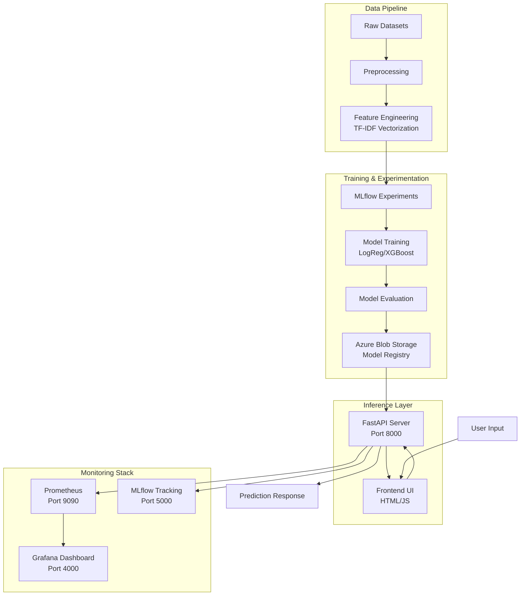

# DetoxifyAI 🛡️

> Real-time ML-powered toxicity detection API for social platforms and content moderation

DetoxifyAI analyzes text content and classifies it as toxic or non-toxic using machine learning models (Logistic Regression and XGBoost) trained on social media datasets. The system provides confidence scores, enabling automated content moderation at scale.

## Architecture



## Quick Start

```bash
# Clone the repository
git clone https://github.com/al-Jurjani/DetoxifyAI.git
cd DetoxifyAI

# Set up environment variables
cp .env.example .env
# Edit .env with your Azure Storage credentials

# Install dependencies
pip install -r requirements.txt

# Run development server
uvicorn app.main:app --reload --host 0.0.0.0 --port 8000
```

Access the application:
- API: http://localhost:8000
- Frontend: Open `frontend/index.html` in a browser
- API Docs: http://localhost:8000/docs

Online VM's (Might be offline)
- MLFlow: http://13.50.244.152:5000/
- Frontend: http://16.16.193.183/

## Prerequisites

- Python 3.11+
- Docker and Docker Compose (for monitoring stack)
- Azure Storage Account (for model artifacts)
- MLflow (for experiment tracking)

## Make Targets

**Note:** This project currently uses direct commands. A Makefile can be added for convenience:

### Development
```bash
# Install dependencies
pip install -r requirements.txt

# Install development dependencies
pip install -r requirements-dev.txt

# Run FastAPI server with hot-reload
uvicorn app.main:app --reload --host 0.0.0.0 --port 8000

# Open Python shell with environment
python
```

### Testing
```bash
# Run all tests with coverage (65% minimum)
pytest --cov=app --cov-report=xml --cov-fail-under=65

# Run tests with verbose output
pytest -v

# Run linting (ruff + black)
ruff check .
black --check .

# Auto-format code
black .
```

### Docker Operations
```bash
# Build production Docker image
docker build -t detoxifyai:latest .

# Run Docker container locally
docker run -p 8000:8000 --env-file .env detoxifyai:latest

# Start monitoring stack (Prometheus + Grafana)
docker-compose up --build

# Stop all containers
docker-compose down
```

### ML Operations
```bash
# Train model with MLflow tracking
cd MLFlow/experiments
export MLFLOW_TRACKING_URI="http://127.0.0.1:5000"

# For Windows PowerShell:
$env:MLFLOW_TRACKING_URI = "http://127.0.0.1:5000"

# Run XGBoost experiments
mlflow run . --env-manager=local --experiment-name xg_models

# Run Logistic Regression experiments
mlflow run . --env-manager=local --experiment-name lr_models

# Start MLflow UI
mlflow ui --host 0.0.0.0 --port 5000

# View experiment results at http://localhost:5000
```

### Deployment
```bash
# Check API health status
curl http://localhost:8000/health

# Test prediction endpoint
curl -X POST http://localhost:8000/predict \
  -H "Content-Type: application/json" \
  -d '{"text": "Your text here"}'

# View Prometheus metrics
curl http://localhost:8000/metrics
```

## Project Structure

```
.
├── app/                          # FastAPI application
│   └── main.py                  # Main API with endpoints, model loading, metrics
├── frontend/                     # Web interface
│   ├── index.html               # Frontend UI
│   ├── app.js                   # JavaScript logic
│   └── styles.css               # Styling
├── MLFlow/                       # Machine learning experiments
│   ├── experiments/
│   │   ├── train.py            # Training script with hyperparameter tuning
│   │   ├── MLproject           # MLflow project configuration
│   │   ├── params.yaml         # Default hyperparameters
│   │   └── combined_dataset.csv # Training data
│   └── src/
│       └── testing_mlflow.py   # MLflow integration tests
├── mlflow/                       # Duplicate folder (lowercase)
│   └── experiments/             # Model artifacts cache
├── tests/                        # Test suite
│   ├── test_stub.py            # Test placeholder
│   └── golden.json             # Acceptance test queries
├── deploy/                       # Deployment documentation
│   └── AWS_DEPLOYMENT.md       # AWS deployment guide
├── prometheus/                   # Monitoring configuration
│   └── prometheus.yml          # Prometheus scrape config
├── grafana/                      # Grafana dashboards (if configured)
├── Data/                         # Raw datasets (gitignored)
├── Evidently/                    # Data drift monitoring
├── .github/
│   └── workflows/
│       └── ci.yml              # CI/CD pipeline (lint, test, build, canary)
├── docker-compose.yml           # Multi-container orchestration
├── Dockerfile                   # Production container image
├── requirements.txt             # Python dependencies
├── requirements-dev.txt         # Development dependencies
├── .env.example                 # Environment variables template
├── .pre-commit-config.yaml     # Pre-commit hooks
├── CONTRIBUTION.md             # Contribution guidelines
├── CODE_OF_CONDUCT.md          # Code of conduct
└── README.md                    # This file
```

## ML Workflow Monitoring

### MLflow Tracking
- **Tracking URI**: http://localhost:5000
- **Model Registry**: Azure Blob Storage (`mlflow-artifacts-mlops-proj` container)
- **Logged Artifacts**:
  - Trained models (model.pkl)
  - TF-IDF vectorizers (tfidf.pkl)
  - Metrics (ROC-AUC, Accuracy, F1-score)
  - Hyperparameters (preprocessor type, ngrams, C, eta, etc.)

#### Starting MLflow
```bash
# Navigate to experiments directory
cd MLFlow/experiments

# Set tracking URI
export MLFLOW_TRACKING_URI="http://127.0.0.1:5000"  # Linux/Mac
$env:MLFLOW_TRACKING_URI = "http://127.0.0.1:5000"  # Windows

# Start MLflow UI server
mlflow ui --host 0.0.0.0 --port 5000

# In another terminal, run experiments
mlflow run . --env-manager=local --experiment-name xg_models
```

### Evidently Dashboard
- **Purpose**: Data drift detection on test sets
- **Location**: `Evidently/` and `evidently_workspace/` directories
- **Usage**: Monitors model performance degradation over time

### Prometheus + Grafana
- **Prometheus**: http://localhost:9090
- **Grafana**: http://localhost:4000 (admin/admin)
- **Monitored Metrics**:
  - `app_request_count` - Total API requests by endpoint
  - `app_request_latency_seconds` - Request latency histogram (p50, p95, p99)
  - Node exporter metrics (CPU, memory, disk)

#### Starting the Monitoring Stack
```bash
# Start all services
docker-compose up --build

# Services will be available at:
# - FastAPI metrics: http://localhost:8000/metrics
# - Prometheus: http://localhost:9090
# - Grafana: http://localhost:4000

# Stop services
docker-compose down
```


## API Documentation

### Interactive Documentation
- **Swagger UI**: http://localhost:8000/docs
- **ReDoc**: http://localhost:8000/redoc

### Endpoints

#### Health Check
```bash
GET /health

Response:
{
  "status": "ok",
  "model_loaded": true
}
```

#### Predict Toxicity
```bash
POST /predict

Request Body:
{
  "text": "Your comment or text to analyze"
}

Response:
{
  "input": "Your comment or text to analyze",
  "prediction": "toxic" | "non-toxic",
  "confidence": 0.87,
  "toxic_probability": 0.13,
  "model_loaded": true
}
```

#### Prometheus Metrics
```bash
GET /metrics

Returns Prometheus-formatted metrics for scraping
```

### Example Usage

```python
import requests

# Health check
response = requests.get("http://localhost:8000/health")
print(response.json())

# Predict toxicity
payload = {"text": "You are amazing and helpful!"}
response = requests.post("http://localhost:8000/predict", json=payload)
result = response.json()

print(f"Prediction: {result['prediction']}")
print(f"Confidence: {result['confidence']:.2%}")
print(f"Toxicity Probability: {result['toxic_probability']:.2%}")
```

## Cloud Deployment

### Azure Services Used

#### Azure Blob Storage
- **Purpose**: Store MLflow artifacts (models, vectorizers, metrics)
- **Container**: `mlflow-artifacts-mlops-proj`
- **Why**: Centralized model registry with versioning, accessible from any environment

#### Model Loading
The FastAPI application loads models directly from Azure Blob Storage on startup:
1. Connects using `AZURE_STORAGE_CONNECTION_STRING` from environment
2. Downloads `model.pkl` and `tfidf.pkl` from specified blob paths
3. Loads models into memory using joblib
4. Serves predictions without local file dependencies

### Setup Instructions

#### 1. Azure Storage Setup
```bash
# Create storage account (via Azure Portal or CLI)
az storage account create \
  --name <storage-account-name> \
  --resource-group <resource-group> \
  --location eastus \
  --sku Standard_LRS

# Get connection string
az storage account show-connection-string \
  --name <storage-account-name> \
  --resource-group <resource-group>

# Create container for MLflow artifacts
az storage container create \
  --name mlflow-artifacts-mlops-proj \
  --connection-string "<connection-string>"
```

#### 2. Configure Environment Variables
```bash
# Copy example file
cp .env.example .env

# Edit .env and add:
AZURE_STORAGE_CONNECTION_STRING="DefaultEndpointsProtocol=https;AccountName=...;AccountKey=...;EndpointSuffix=core.windows.net"
MLFLOW_TRACKING_URI=http://localhost:5000
```

#### 3. Deploy to AWS (Optional)
See [deploy/AWS_DEPLOYMENT.md](deploy/AWS_DEPLOYMENT.md) for detailed AWS deployment instructions.

### Service Interaction Flow

```
Data (local/S3) → Training (MLflow) → Model Registry (Azure Blob) → FastAPI API (Docker/EC2) → Monitoring (Prometheus/Grafana)
```

### CI/CD Pipeline

The project uses GitHub Actions for continuous integration:

```yaml
Workflow: .github/workflows/ci.yml
Triggers: Push to main, Pull requests to main

Jobs:
1. Lint (ruff + black code quality checks)
2. Test (pytest with 65% coverage requirement)
3. Build & Push (Docker image to ghcr.io)
4. Canary Deploy + Acceptance Tests (golden queries validation)

Environment Variables:
- AZURE_STORAGE_CONNECTION_STRING (secret)
- IMAGE_NAME: ghcr.io/al-jurjani/detoxifyai
```

## FAQ

### Common Build Errors

**Q: Docker build fails with "unable to find image"**
```bash
# Solution: Pull base image explicitly
docker pull python:3.11-slim
```

**Q: Permission denied when running Docker commands**
```bash
# Solution (Linux): Add user to docker group
sudo usermod -aG docker $USER
newgrp docker  # Refresh group membership

# Solution (Windows): Run Docker Desktop as Administrator
```

**Q: Port already in use errors**
```bash
# Solution: Stop conflicting services
docker-compose down

# Or find and kill process using the port
# Linux/Mac:
lsof -ti:8000 | xargs kill -9

# Windows:
netstat -ano | findstr :8000
taskkill /PID <PID> /F

# Or change ports in docker-compose.yml
```

**Q: Module not found errors**
```bash
# Solution: Reinstall dependencies
pip install --upgrade pip
pip install -r requirements.txt

# If using virtual environment, ensure it's activated
source venv/bin/activate  # Linux/Mac
venv\Scripts\activate     # Windows
```

### Platform-Specific Setup

#### Windows
```bash
# Option 1: Use WSL2 (Recommended)
wsl --install
wsl --set-default-version 2

# Install Docker Desktop for Windows
# Enable WSL2 integration in Docker Desktop settings

# Clone repo in WSL2 environment
cd /home/<username>
git clone https://github.com/al-Jurjani/DetoxifyAI.git

# Run commands in WSL2 terminal
cd DetoxifyAI
pip install -r requirements.txt
uvicorn app.main:app --reload

# Option 2: Native Windows (PowerShell)
# Set environment variables
$env:MLFLOW_TRACKING_URI = "http://127.0.0.1:5000"
$env:AZURE_STORAGE_CONNECTION_STRING = "your-connection-string"

# Run uvicorn
python -m uvicorn app.main:app --reload
```

#### macOS
```bash
# Install Docker Desktop for Mac
brew install --cask docker

# Install Python 3.11
brew install python@3.11

# Clone and setup
git clone https://github.com/al-Jurjani/DetoxifyAI.git
cd DetoxifyAI
python3.11 -m venv venv
source venv/bin/activate
pip install -r requirements.txt

# Run server
uvicorn app.main:app --reload
```

#### Linux (Ubuntu/Debian)
```bash
# Install Docker
curl -fsSL https://get.docker.com -o get-docker.sh
sudo sh get-docker.sh
sudo usermod -aG docker $USER
newgrp docker

# Install Python 3.11
sudo apt update
sudo apt install python3.11 python3.11-venv python3-pip

# Clone and setup
git clone https://github.com/al-Jurjani/DetoxifyAI.git
cd DetoxifyAI
python3.11 -m venv venv
source venv/bin/activate
pip install -r requirements.txt

# Run server
uvicorn app.main:app --reload
```

### Development Issues

**Q: Pre-commit hooks failing**
```bash
# Reinstall hooks
pre-commit uninstall
pre-commit install
pre-commit run --all-files

# Skip hooks temporarily (not recommended for commits)
git commit --no-verify -m "message"
```

**Q: Test coverage below 80%**
```bash
# Generate coverage report
pytest --cov=app --cov-report=html --cov-report=term

# Open htmlcov/index.html to see uncovered lines
# Add tests for uncovered code paths
```

**Q: MLflow not tracking experiments**
```bash
# Verify tracking URI
echo $MLFLOW_TRACKING_URI  # Linux/Mac
echo $env:MLFLOW_TRACKING_URI  # Windows PowerShell

# Ensure MLflow server is running
mlflow ui --host 0.0.0.0 --port 5000

# Check Azure connection string
python -c "import os; print(os.getenv('AZURE_STORAGE_CONNECTION_STRING'))"

# Test Azure connection
from azure.storage.blob import BlobServiceClient
client = BlobServiceClient.from_connection_string("<your-connection-string>")
print(client.list_containers())
```

**Q: Model not loading from Azure**
```bash
# Check error logs
docker logs <container-id>

# Verify blob paths in app/main.py match your MLflow artifacts
# Default paths:
# xg_model_blob_path = "3/4690eeee10294ed0bf0d12132887b898/artifacts/model/model.pkl"
# xg_vectorizer_blob_path = "3/4690eeee10294ed0bf0d12132887b898/artifacts/vectorizer/tfidf.pkl"

# List blobs in container to find correct paths
az storage blob list \
  --container-name mlflow-artifacts-mlops-proj \
  --connection-string "<connection-string>" \
  --output table
```

**Q: Frontend can't connect to API**
```bash
# Check if API is running
curl http://localhost:8000/health

# Verify CORS settings in app/main.py
# Current setting: allow_origins=["*"] (allows all origins)

# If using different ports, update API_URL in frontend/app.js
const API_URL = 'http://localhost:8000';  // Change if needed
```

**Q: Docker Compose services won't start**
```bash
# Check service logs
docker-compose logs prometheus
docker-compose logs grafana

# Restart specific service
docker-compose restart prometheus

# Clean rebuild
docker-compose down -v
docker-compose up --build
```

## Security

- Security vulnerabilities are scanned via `pip-audit` in CI pipeline (planned)
- **Important**: Never commit `.env` files with credentials to version control
- Use Azure Managed Identity or Service Principal for production deployments
- API currently allows CORS from all origins (`allow_origins=["*"]`) - restrict in production

## Contributing

See [CONTRIBUTION.md](CONTRIBUTION.md) for:
- Development workflow
- Code style guidelines
- Pull request process
- Branching strategy

## License

This project is licensed under the MIT License - see [LICENSE.MD](LICENSE.MD) file for details.

## Code of Conduct

Please read our [Code of Conduct](CODE_OF_CONDUCT.md) before contributing.

## Bonus Features Status

### Not Implemented (from D1 bonus list):
- [ ] **Docker Compose with dev/test/prod profiles** - Current docker-compose.yml only includes monitoring services (Prometheus, Grafana, Node Exporter). No separate profiles for dev/test/prod environments, and no app/db services defined.
- [ ] **GPU-enabled image and self-hosted runner** - Standard CPU-only Docker image with `python:3.11-slim` base.
- [ ] **Infrastructure as Code (IaC)** - No Terraform/CloudFormation templates. No `infra/` or `scripts/` directories for IaC automation.
- [ ] **End-to-end load testing with k6** - No k6 scripts or latency SLO assertions implemented.
- [ ] **Data Version Control (DVC/Git-LFS)** - No DVC or Git-LFS configuration for dataset versioning.

### Related Features Implemented (outside bonus scope):
- [x] Basic Docker Compose for monitoring stack (Prometheus, Grafana, Node Exporter)
- [x] MLflow experiment tracking with Azure Blob Storage backend
- [x] CI/CD pipeline with GitHub Actions (test, build, canary deploy, acceptance tests)
- [x] Evidently integration for data drift monitoring
- [x] Production Dockerfile with healthchecks
- [x] Prometheus metrics instrumentation in FastAPI

## Quick Reference Commands

### Running the Full Stack

```bash
# Terminal 1: Start MLflow server
cd MLFlow/experiments
export MLFLOW_TRACKING_URI="http://127.0.0.1:5000"
mlflow ui --host 0.0.0.0 --port 5000

# Terminal 2: Start FastAPI + Monitoring
docker-compose up --build

# Terminal 3: Open frontend
cd frontend
# Open index.html in browser, or serve with:
python -m http.server 3000

# Access points:
# - Frontend: http://localhost:3000
# - API: http://localhost:8000
# - API Docs: http://localhost:8000/docs
# - MLflow: http://localhost:5000
# - Prometheus: http://localhost:9090
# - Grafana: http://localhost:4000
```

### Training New Models

```bash
cd MLFlow/experiments

# Edit params.yaml to adjust hyperparameters
# Then run experiment:

$env:MLFLOW_TRACKING_URI = "http://127.0.0.1:5000"
mlflow run . --env-manager=local --experiment-name xg_models

# View results in MLflow UI
# Update blob paths in app/main.py with new artifact locations
```

## Contact

For questions or issues, please open a GitHub issue or contact the team at:
- Repository: https://github.com/al-Jurjani/DetoxifyAI
- Issues: https://github.com/al-Jurjani/DetoxifyAI/issues

## Acknowledgments

- Built with FastAPI, Scikit-learn, XGBoost, MLflow
- Monitoring stack: Prometheus, Grafana
- Cloud storage: Azure Blob Storage
- CI/CD: GitHub Actions
- Frontend: Vanilla HTML/CSS/JavaScript


