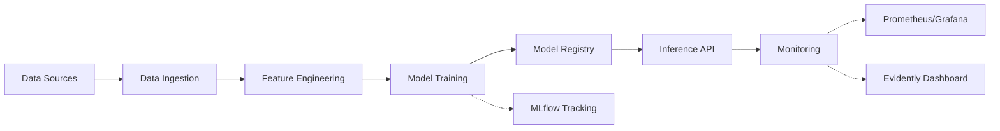

# DetoxifyAI

> One-line elevator pitch describing what your ML system does and the problem it solves

## Architecture



## Quick Start

```bash
# Clone the repository
git clone https://github.com/your-org/your-repo.git
cd your-repo

# Start development environment
make dev
```

## Prerequisites

- Docker and Docker Compose
- Python 3.11+
- Make
- Git

## Make Targets

### Development
```bash
make dev          # Start development environment with hot-reload
make install      # Install dependencies locally
make shell        # Open shell in Docker container
```

### Testing
```bash
make test         # Run all tests with coverage report
make test-unit    # Run unit tests only
make test-integration  # Run integration tests
make lint         # Run linting (ruff + black)
make format       # Auto-format code with black
```

### Docker Operations
```bash
make docker       # Build production Docker image
make docker-dev   # Build development Docker image
make docker-run   # Run Docker container locally
make docker-push  # Push image to registry
```

### ML Operations
```bash
make train        # Train model locally
make mlflow-ui    # Start MLflow UI on localhost:5000
make evidently    # Start Evidently dashboard on localhost:7000
make monitor      # Start Prometheus + Grafana stack
```

### Deployment
```bash
make deploy-canary    # Deploy to canary environment
make deploy-prod      # Deploy to production
make health-check     # Check API health status
```

## Project Structure

```
.
├── src/                    # Source code
│   ├── data/              # Data processing modules
│   ├── models/            # Model definitions
│   ├── api/               # FastAPI application
│   └── monitoring/        # Monitoring utilities
├── tests/                 # Test suite
│   ├── unit/
│   └── integration/
├── infra/                 # Infrastructure as Code
│   └── terraform/
├── scripts/               # Utility scripts
├── notebooks/             # Exploratory notebooks
├── data/                  # Data directory (gitignored)
├── models/                # Saved models (gitignored)
├── .github/
│   └── workflows/         # CI/CD pipelines
├── Dockerfile
├── docker-compose.yml
├── Makefile
├── pyproject.toml
├── requirements.txt
└── README.md
```

## ML Workflow Monitoring

### MLflow Tracking
- **Tracking URI**: [http://localhost:5000](http://localhost:5000) or your hosted URL
- **Model Registry**: Model v1 registered and available
- Access experiments, parameters, and metrics through the MLflow UI

### Evidently Dashboard
- **URL**: [http://localhost:7000](http://localhost:7000)
- Monitors data drift on held-out test set
- Provides visual analysis of model performance degradation

### Prometheus + Grafana
- **Prometheus**: [http://localhost:9090](http://localhost:9090)
- **Grafana**: [http://localhost:3000](http://localhost:3000)
- **Monitored Metrics**:
  - GPU utilization
  - Request latency (p50, p95, p99)
  - Prediction throughput
  - Error rates


## API Documentation

### Interactive Documentation
- **Swagger UI**: [http://localhost:8000/docs](http://localhost:8000/docs)
- **ReDoc**: [http://localhost:8000/redoc](http://localhost:8000/redoc)

### Example Usage

```bash
# Health check
curl http://localhost:8000/health

# Prediction request
curl -X POST http://localhost:8000/predict \
  -H "Content-Type: application/json" \
  -d '{
    "input_data": "your input here",
    "model_version": "v1"
  }'
```

### JSON Schema

```json
{
  "input_data": "string or appropriate type",
  "model_version": "string (optional, defaults to latest)",
  "parameters": {
    "threshold": "float (optional)",
    "top_k": "integer (optional)"
  }
}
```

## Cloud Deployment

### Services Used

#### AWS Services
- **EC2**: Hosting the inference API on t3.medium instance
- **S3**: Data storage for training datasets and model artifacts
- **CloudWatch**: Centralized logging and monitoring
- **[Add more if applicable]**

#### Why These Services
- EC2 provides scalable compute for serving predictions
- S3 offers durable, versioned storage for ML artifacts
- CloudWatch enables real-time monitoring and alerting

### Setup Instructions

1. Configure AWS credentials:
```bash
aws configure
```

2. Deploy infrastructure:
```bash
cd infra/terraform
terraform init
terraform plan
terraform apply
```

3. Verify deployment:
```bash
make cloud-health-check
```

### Service Interaction Flow

```
Data (S3) → Training (EC2) → Model Registry (S3) → Inference API (EC2) → Monitoring (CloudWatch)
```


## FAQ

### Common Build Errors

**Q: Docker build fails with "unable to find image"**
```bash
# Solution: Pull base image explicitly
docker pull python:3.11-slim
```

**Q: Permission denied when running make commands**
```bash
# Solution: Add execute permissions
chmod +x scripts/*.sh
```

**Q: Port already in use errors**
```bash
# Solution: Stop conflicting services
docker-compose down
# Or change ports in docker-compose.yml
```

### Platform-Specific Setup

#### Windows
```bash
# Use WSL2 for best compatibility
wsl --install
# Install Docker Desktop for Windows
# Ensure WSL2 integration is enabled in Docker Desktop settings
```

#### macOS
```bash
# Install Docker Desktop for Mac
brew install --cask docker
# Install make if not present
brew install make
```

#### Linux
```bash
# Install Docker
curl -fsSL https://get.docker.com -o get-docker.sh
sh get-docker.sh
# Add user to docker group
sudo usermod -aG docker $USER
```

### Development Issues

**Q: Pre-commit hooks failing**
```bash
# Reinstall hooks
pre-commit uninstall
pre-commit install
pre-commit run --all-files
```

**Q: Test coverage below 80%**
```bash
# Generate coverage report
pytest --cov=src --cov-report=html
# Open htmlcov/index.html to see uncovered lines
```

**Q: MLflow not tracking experiments**
```bash
# Verify tracking URI
echo $MLFLOW_TRACKING_URI
# Restart MLflow server
make mlflow-ui
```

## Security

Security vulnerabilities are scanned via `pip-audit` in CI pipeline. Critical CVEs will fail the build.

## Contributing

See [CONTRIBUTION.md](CONTRIBUTION.md) for development workflow and guidelines.

## License

This project is licensed under the [LICENSE_TYPE] - see [LICENSE](LICENSE) file for details.

## Code of Conduct

Please read our [Code of Conduct](CODE_OF_CONDUCT.md) before contributing.

## Bonus Features Implemented

- [ ] Docker Compose with dev/test/prod profiles
- [ ] GPU-enabled image with self-hosted runner
- [ ] Infrastructure as Code (Terraform)
- [ ] Load testing with k6 and SLO assertions
- [ ] Data version control with DVC/Git-LFS

## Contact

For questions or issues, please open a GitHub issue or contact the team.


-----------------------------
-----------------------------
-----------------------------
to run MLFlow + Azure:

1.) activate virtual environemnt
2.) cd to MLFlow/experiments
3.) First have the mlflow dashboard running by entering 'the command' (in Zuhair's sticky note on desktop)
4.) Then, you'll have the dashboard running. Now you can safely begin testing runs by the command:

    $env:MLFLOW_TRACKING_URI = "http://127.0.0.1:5000"
    mlflow run . --env-manager=local --experiment-name xg_models

    for xgboost model experiments, or alternatively

    $env:MLFLOW_TRACKING_URI = "http://127.0.0.1:5000"
    mlflow run . --env-manager=local --experiment-name lr_models

    for logistic regression model experiements

5.) Once run is complete, it should show up on the mlflow dashboard, and the stored model, vectorizer, and the metrics recorded will inshaAllah be on the Azure blob storage.


to run Prometheus + Grafana:
1.) At the root of your project folder, run docker compose up --build
2.) This may take a while at first, at it is loading the three images.
3.) Once docker loads them up, your fastapi, prometheus, and grafana should be running on the following three links respectively:

    http://localhost:8000/metrics
    http://localhost:9090
    http://localhost:3000/

4.) now you do the stuff you're supposed to do with prometheus and grafana
