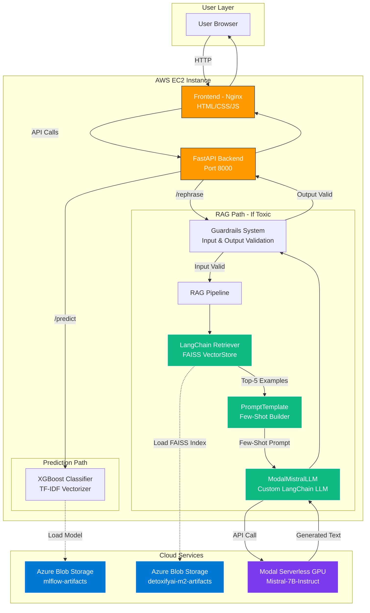
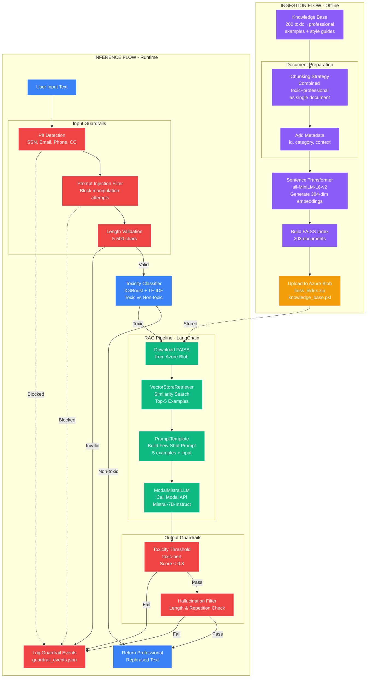

# DetoxifyAI - System Architecture & Data Flow

This document provides detailed diagrams for the DetoxifyAI RAG pipeline implementation.

---

## System Architecture Diagram

This diagram shows the complete system architecture including cloud services, LangChain components, and data flow between services.



### Key Components:

**AWS EC2 Infrastructure:**
- **Frontend (Nginx)**: Serves static HTML/CSS/JS files on port 80
- **FastAPI Backend**: REST API on port 8000 handling `/predict` and `/rephrase` endpoints

**ML Classification Path:**
- **XGBoost Classifier**: Binary toxicity detection using TF-IDF features
- **Model Storage**: XGBoost model and TF-IDF vectorizer stored in Azure Blob Storage

**RAG Pipeline Path (LangChain Integration):**
- **Guardrails System**: Input validation (PII, prompt injection) and output moderation (toxicity, hallucination)
- **LangChain Retriever**: FAISS vector store retriever for similarity search
- **PromptTemplate**: Few-shot prompt builder with top-5 retrieved examples
- **ModalMistralLLM**: Custom LangChain LLM wrapper for Modal-hosted Mistral-7B

**Cloud Services:**
- **Azure Blob Storage**: Stores FAISS index, knowledge base, and ML models
- **Modal Serverless GPU**: Hosts quantized Mistral-7B-Instruct-v0.1 with auto-scaling

---

## Data Flow Diagram

This diagram illustrates both the offline ingestion process and the runtime inference flow, including chunking strategy and guardrails.



### Ingestion Flow (Offline):

1. **Knowledge Base Preparation**: 200 toxic→professional example pairs + 3 style guide documents
2. **Chunking Strategy**: Each example combines toxic and professional text as a single document for better retrieval
3. **Metadata Addition**: Attach id, category (insults, profanity, workplace, etc.), and context fields
4. **Embedding Generation**: Use sentence-transformers/all-MiniLM-L6-v2 to create 384-dimensional embeddings
5. **FAISS Index Building**: Create vector index from 203 documents (200 examples + 3 guides)
6. **Azure Blob Upload**: Store faiss_index.zip and knowledge_base.pkl in detoxifyai-m2-artifacts container

### Inference Flow (Runtime):

**Input Processing:**
1. User submits text via frontend
2. **Input Guardrails**:
   - PII Detection: Block SSN, email, phone, credit card numbers
   - Prompt Injection Filter: Block manipulation attempts ("ignore previous instructions", etc.)
   - Length Validation: Enforce 5-500 character limit
3. **Toxicity Classification**: XGBoost model classifies as toxic or non-toxic

**RAG Pipeline (if toxic):**
4. **FAISS Download**: Load vector index from Azure Blob Storage
5. **Retrieval**: VectorStoreRetriever performs similarity search, returns top-5 examples
6. **Prompt Building**: PromptTemplate creates few-shot prompt with retrieved examples
7. **LLM Generation**: ModalMistralLLM wrapper calls Modal API, Mistral-7B generates professional rephrase

**Output Processing:**
8. **Output Guardrails**:
   - Toxicity Check: toxic-bert model ensures score < 0.3 threshold
   - Hallucination Filter: Validate output length and detect repetitive text
9. **Logging**: All guardrail events logged to guardrail_events.json
10. **Response**: Return professional rephrased text to user

---

## Technical Specifications

### Models:
- **Toxicity Classifier**: XGBoost with TF-IDF vectorization (from Milestone 1)
- **Embedding Model**: sentence-transformers/all-MiniLM-L6-v2 (384 dimensions)
- **LLM**: mistralai/Mistral-7B-Instruct-v0.1 (4-bit quantized on Modal)
- **Guardrails Model**: unitary/toxic-bert for output validation

### Storage:
- **Azure Blob Storage**:
  - Container 1: mlflow-artifacts-mlops-proj (ML models)
  - Container 2: detoxifyai-m2-artifacts (RAG artifacts)
- **FAISS Index**: 203 documents, 384-dimensional vectors
- **Knowledge Base**: 200 toxic→professional pairs + 3 style documents

### LangChain Components (Bonus):
- **Custom LLM**: ModalMistralLLM wrapper implementing LangChain LLM base class
- **Retriever**: VectorStoreRetriever with similarity search (k=5)
- **PromptTemplate**: Structured few-shot prompt template
- **Chain**: LCEL pipeline (PromptTemplate | LLM | StrOutputParser)

### Deployment:
- **Frontend**: Nginx on AWS EC2 (port 80)
- **Backend**: FastAPI on AWS EC2 (port 8000)
- **LLM**: Modal serverless GPU (auto-scaling, 5-min idle timeout)
- **Instance**: t2.small (2GB RAM, 16GB storage)

---

## Guardrails Summary

### Input Validation Rules:
1. **PII Detection**: Blocks SSN, email, phone numbers, credit cards using regex patterns
2. **Prompt Injection Filter**: Detects manipulation attempts (12 keyword patterns)
3. **Length Limits**: Enforces 5-500 character range

### Output Moderation Rules:
1. **Toxicity Threshold**: toxic-bert score must be < 0.3
2. **Hallucination Filter**:
   - Minimum 10 characters
   - Repetition ratio check (unique words / total words > 0.3)

### Monitoring:
- All guardrail events logged to `guardrail_events.json` with timestamps
- Tracks: event type, rule triggered, text sample (PII redacted), metadata
- Available via `/guardrails/events` endpoint for monitoring dashboard

---

## API Endpoints

### `/predict` - Toxicity Detection
**Method**: POST
**Input**: `{"text": "string"}`
**Output**:
```json
{
  "input": "original text",
  "prediction": "toxic" | "non-toxic",
  "confidence": 0.95,
  "toxic_probability": 0.95,
  "model_loaded": true
}
```

### `/rephrase` - RAG Rephrasing
**Method**: POST
**Input**: `{"text": "string"}`
**Output**:
```json
{
  "input": "toxic text",
  "is_toxic": true,
  "rephrased": "professional alternative",
  "retrieved_examples": [
    {
      "toxic": "example toxic",
      "professional": "example professional",
      "category": "workplace"
    }
  ],
  "num_examples_used": 5
}
```

---

## Access

**Live Deployment**: http://100.31.135.60
**API Documentation**: http://100.31.135.60:8000/docs
**Health Check**: http://100.31.135.60:8000/health
